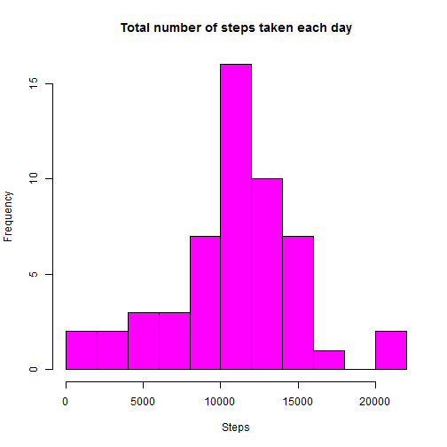
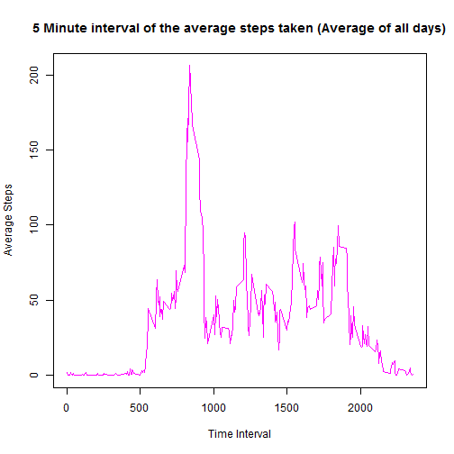
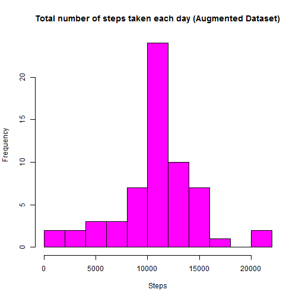
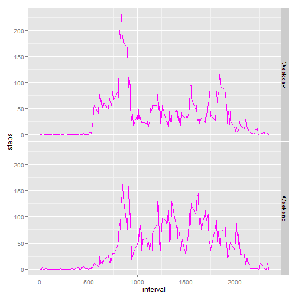

Reproducible Research: Peer Assessment 1
============================================

##Loading and preprocessing the data
#####1. Loading the data

```r
require(data.table)  ## Fast and Friendly File Finagler package.
```

```
## Loading required package: data.table
## data.table 1.9.2  For help type: help("data.table")
```

```r
##  Uncommpress the zip file into the same directory.
unzip("activity.zip")
## fread() function from data.table package for speed and robustness to load raw dataset.
raw.data <- fread("activity.csv", header = TRUE)
```
#####2. Preprocessing and transforming the data

```r
## Remove NA values
work.data <- raw.data[!is.na(steps)]
## Preformatting date
work.data[, date := as.Date(date)]
```
##What is mean total number of steps taken per day?
#####1. Histogram of the total number of steps taken each day

```r
## Summarize daily steps
total.steps_perDay <- work.data[, list(steps = sum(steps)), by = date]
## Plot histogram of daily steps
hist(total.steps_perDay$steps,
     breaks = 15,
     col = "magenta",
     main = "Total number of steps taken each day",
     xlab = "Steps")
```

 
 
#####2. The __mean__ and __median__ total number of steps taken per day

```r
## Averages (set as integers)
meanSteps <- as.integer(mean(total.steps_perDay$steps))
medianSteps <- as.integer(median(total.steps_perDay$steps))
```
The mean and median total number of steps taken per day:

Mean: 10766 / Median: 10765

##What is the average daily activity pattern?
#####1. Time series plot of the 5 minute interval and the average number of steps taken, averaged across all days

```r
## Summarize average steps by time interval
avg.steps_perInterval <- work.data[, list(steps = mean(steps)), by = interval]
## Plot time series of average steps
with(avg.steps_perInterval,
     plot(interval,
          steps,
          type = "l",
          col = "magenta",
          main = "5 Minute interval of the average steps taken (Average of all days)",
          xlab = "Time Interval",
          ylab = "Average Steps"))
```

 
 
#####2. Which 5-minute interval, on average across all the days in the dataset, contains the maximum number of steps?

```r
## Interval of maximum steps
maxSteps <- avg.steps_perInterval[steps == max(steps), interval]
```
The 5-minute interval of maximum steps is 835

##Imputing missing values
#####1. Total number of missing values in the dataset (i.e. the total number of rows with NAs)

```r
## Calculating NA values
naValues <- sum(is.na(raw.data$steps))
```
Number of missing values is 2304

#####2. Strategy for filling in all of the missing values in the dataset.
Using average of the 5 minute interval to replace NA data.

#####3. New dataset that is equal to the original dataset but with the missing data filled in.

```r
## Replace missing values with average of the five-minute interval.
## Merge 'raw' dataset of included NA's with 'average steps per interval' dataset by Interval
augmented.data <- merge(raw.data, avg.steps_perInterval, by = "interval",
                        suffixes=c(".raw", ".avgSteps"))
## New 'steps' column: If NA exists then replace with average for said interval, else copy interger
augmented.data$steps <- ifelse(is.na(augmented.data$steps.raw),
                                  augmented.data$steps.avgSteps,
                                  augmented.data$steps.raw)
## Tidy dataset - remove nonesential columns
augmented.data <- data.table(steps = augmented.data$steps,
                             date = as.Date(augmented.data$date),
                             interval = augmented.data$interval)
```
A summary of the new dataset with imputed values:

```r
## Summarize new dataset
summary(augmented.data)
```

```
##      steps            date               interval   
##  Min.   :  0.0   Min.   :2012-10-01   Min.   :   0  
##  1st Qu.:  0.0   1st Qu.:2012-10-16   1st Qu.: 589  
##  Median :  0.0   Median :2012-10-31   Median :1178  
##  Mean   : 37.4   Mean   :2012-10-31   Mean   :1178  
##  3rd Qu.: 27.0   3rd Qu.:2012-11-15   3rd Qu.:1766  
##  Max.   :806.0   Max.   :2012-11-30   Max.   :2355
```

#####4. Histogram of the total number of steps taken each day and the mean and median total number of steps taken per day (New augmented dataset). 

```r
## Summarize daily steps of new augmented dataset
augmentedTotal.steps_perDay <- augmented.data[, list(steps = sum(steps)), by = date]
## Plot histogram of daily steps of new augmented dataset
hist(augmentedTotal.steps_perDay$steps,
     breaks = 15,
     col = "magenta",
     main = "Total number of steps taken each day (Augmented Dataset)",
     xlab = "Steps")
```

 
 
#####The __mean__ and __median__ total number of steps taken per day (New augmented dataset)

```r
## Averages (set as integers)
augmentedMeanSteps <- as.integer(mean(augmentedTotal.steps_perDay$steps))
augmentedMedianSteps <- as.integer(median(augmentedTotal.steps_perDay$steps))
```
The mean and median total number of steps taken per day (New augmented dataset):

Mean: 10766  / Median: 10766

#####Do these values differ from the estimates from the first part of the assignment?

#####What is the impact of imputing missing data on the estimates of the total daily number of steps?

As observed, the mean is the same, but the median has changed. The mean is expected to remain constant because the mean was used to fill in the missing values.  The median has changed because number of observations has changed between the two datasets which caused the median midpoint to slightly realign to the new mid observation.

##Are there differences in activity patterns between weekdays and weekends?
#####1. New factor variable in the dataset with two levels - "weekday" and "weekend" indicating whether a given date is a weekday or weekend day

```r
## Update dataset to include weekday levels
augmented.data$day <- as.factor(ifelse
                                (weekdays
                                 (augmented.data$date) %in%
                                         c("Saturday","Sunday"), "Weekend", "Weekday")) 
```
#####2. Panel plot containing a time series plot of the 5-minute interval and the average number of steps taken, averaged across all weekday days or weekend days 

```r
## Summarize average steps by time interval and day
avg.steps_perIntervalDay <- augmented.data[, list(steps = mean(steps)), list(interval, day)]
## Panel plot of time series split by weekday ~ weekend
require(ggplot2)
```

```
## Loading required package: ggplot2
```

```r
ggplot(avg.steps_perIntervalDay,
       aes(interval, steps)) +
        geom_line(colour = "magenta") +
        facet_grid(day ~ .)
```

 
 
As observed:
The weekday and weekend somewhat consistent throughout the day.  The most obvious difference is in the morning and evening.  This may be explained by the sample individuals sleeping into later hours and going to bed at later hours on the weekend.
 
 
  
   ;)
